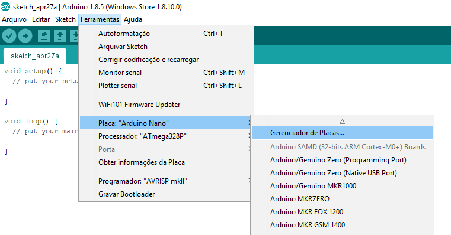
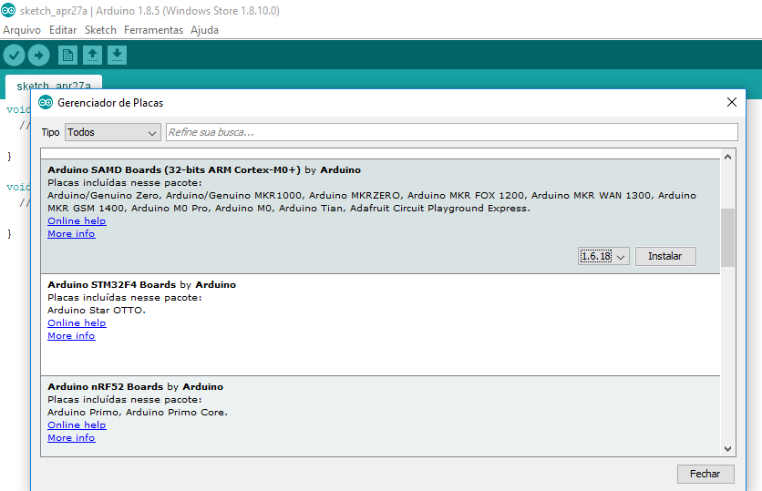
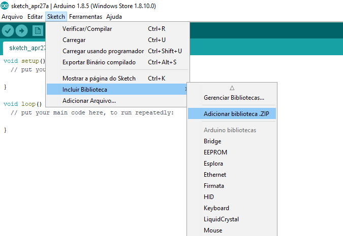
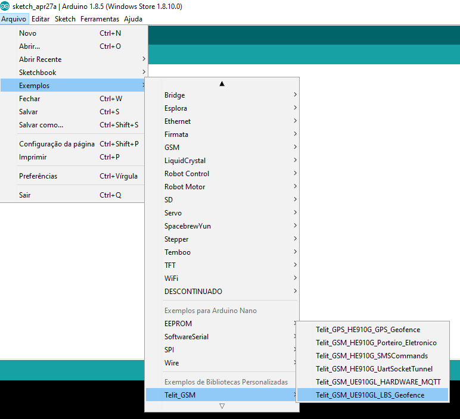

*Para utilização da placa Arduino M0 pro, são disponibilizadas todas as informações necessárias para configuração e inclusão das bibliotecas Telit, contendo os códigos de exemplos, no ambiente de desenvolvimento do Arduino.*

##Instalação do pacote para placa Arduino M0 Pro.

Na IDE do Arduino através do Gerenciador de Placas, pode-se adicionar um pacote para utilização da placa Arduino M0 Pro. Para isso deve-se na IDE abrir o menu: *Ferramenta > Placa:"Arduino" > Gerenciador de Placas...* conforme a imagem abaixo. 

Instale o pacote *Arduino SAMD Boards (32-bits ARM Cortex-M0+)* conforme a imagem abaixo.

##Instalação das Bibliotecas Telit para Arduino.

Disponível na IDE do Arduino existe um Gerenciador de Bibliotecas onde você pode adicionar rapidamente uma biblioteca que está compactada no formato .ZIP ou até mesmo a pasta. Para isso deve-se na IDE abrir o menu: *Sketch > Incluir Biblioteca (Include Library) > Adicionar Biblioteca .ZIP (Add .ZIP Library...)* conforme a imagem abaixo.

Selecione a Biblioteca desejada, no caso a Telit_GSM. Caso tenha seguido todos os passos corretamente verá uma mensagem "Biblioteca adicionada às suas bibliotecas." Para abrir um exemplo da Biblioteca instalada é só ir em: *Arquivo > Exemplos > Telit_GSM > Telit_GSM_UE910GL_LBS_Geofence* conforme a imagem abaixo.

