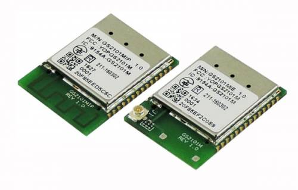
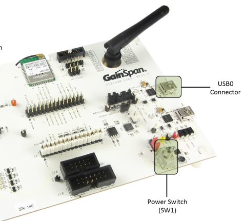
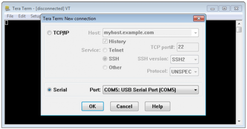
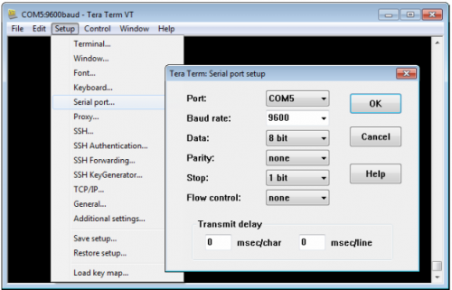
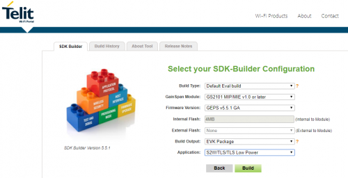
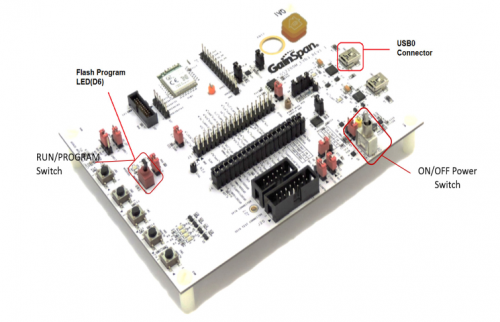
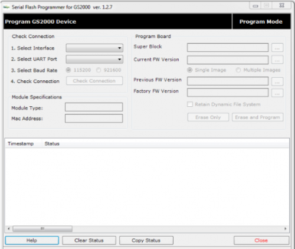

*Aqui são disponibilizadas todas as informações necessárias para montagem, configuração, testes e utilização do módulo Telit GS2101M.*

##Sobre o Módulo GS2101M

A série GS2101M é um módulo Wi-Fi (IEEE 802.11 b / g / n) totalmente certificado e seguro que oferece integração rápida e econômica da conectividade Wi-Fi aos projetos de produtos. A série está disponível com uma antena de rastreio PCB opcional ou conector U.FL.

###Características

- 3 ADCs sigma-delta de 16 bits, ideais para dispositivos inteligentes de medição e energia
- 18 x 25 x 2,7 mm 40 pinos
- Medição de alta resolução e medição de energia
- Modo sem host (sem MCU externo), executando Wi-Fi completo e pilha de rede TCP/IP
- Modo host, a biblioteca de comandos AT mais abrangente conectando-se a qualquer microcontrolador host de 8/16/32 bits usando interfaces UART, SPI ou SDIO
- Fácil provisionamento de smartphones com AP limitado ou Wi-Fi Protected Set-up (WPS)
- Baixo consumo com recursos de gerenciamento de energia: 2,7V - 3,6V, 3,3V nominal

##Referências

* [Página do Módulo](https://www.telit.com/products/wifi-and-bluetooth-modules/gs2101m/)
* [Telit GS2101M Datasheet](https://www.telit.com/wp-content/uploads/2017/09/Telit_GS2101M_Datasheet_2.pdf)
* [Telit GS2101M AT Commands](https://www.telit.com/wp-content/uploads/2018/02/GS2101M-S2W-Adapter-Command-Reference-Guide.pdf)
* [Serial to Wifi User Guide](http://www.janus-rc.com/Documentation/Serial_to_WiFi_Adapter_Guide%20ver%205_6.pdf)
* [IP to Wifi User Guide](https://www.nxp.com/docs/en/supporting-information/GS-IP2WF-APG.pdf)
 
##Sobre o Kit de Desenvolvimento GainSpan GS2100M EVB3

*Kit de Desenvolvimento oficial do módulo GS2101M.*

###Referências

* [GS2K Module Evaluation Board Hardware User Guide](https://s3.amazonaws.com/site_support/uploads/document_upload/GS2K_Module_Evaluation_Board_Hardware_User_Guide.pdf)
* [GS2K Module Programing User Guide](https://www.telit.com/wp-content/uploads/2018/02/GS2K-Module-Programming-User-Guide_r2.0.pdf)
* [GS2K S2W User Case Reference Guide](https://www.telit.com/wp-content/uploads/2018/02/GS2K-S2W-Use-Case-Reference-Guide_r15.pdf)

##Configuração do Ambiente de Hardware

*Os procedimentos de setup inicial contidos no documento: [GS2K Module Evaluation Board Hardware User Guide](https://s3.amazonaws.com/site_support/uploads/document_upload/GS2K_Module_Evaluation_Board_Hardware_User_Guide.pdf) serão listados a seguir:*

**1 - Conectar a placa EVB3 através de seu conector microUSB (USB0) na porta USB do computador (a alimentação da placa ocorre pela USB do computador).**

**2 - Instalar o drive FTDI.**

**3 - Instalar o software serial TeraTerm VT termial.**

**4 - Executar o TeraTerm e configurar a porta serial como nas imagens abaixo:**

**Obs. 1:** Os primeiros testes realizados com o kit EVB3 só funcionaram com o baudrate 460800 para a versão 3.5.0 do firmware de avaliação (AT+VER=?? -> comando que retorna a versão de firmware instalado na placa). 

**Obs. 2:** O envio de comandos AT também podem ser realizados através do software AT Controller disponível na área de downloads no site da Telit.   

###Atualização de Firmware

*O procedimento de atualização de firmware foi realizado seguindo a documentação técnica: [GS2K Module Programming User Guide](https://www.telit.com/wp-content/uploads/2018/02/GS2K-Module-Programming-User-Guide_r2.0.pdf).*

**1 - Acessar o site [http://www.gainspan.com.br](http://www.gainspan.com.br) e realizar o cadastro para ter acesso a portal de suporte.**

**2 - Clique em SDK Buikder e selecione o módulo GS2000 como indicado na figura abaixo.**

**Obs. 1:** Clique em next na próxima tela.

**3 - Na tela apresentada abaixo, foi selecionada opção para criação do firmware de avaliação da EVB3.**

**Obs: 1:** Após clicar em next nesta tela, uma versão do firmware, com as configurações selecionadas, será criada. Em seguida ao clicar na aba Build History, o projeto do firmware, com a ferramenta de atualização e documentações, estará disponível para download em alguns minutos.

**4 - Configure a placa para o modo de program na chave (vermelha), conecte a placa pela usb0 no computador e ligue a chave de alimentação da placa como indicado na imagem abaixo. **

**5 - Na pasta Tools está disponível a ferramenta de atualização de firmware GS_programming_tool.**

 
**Obs. 1:** Selecione os parâmetros de conexão e clique em check connection para verificar se existe comunicação com a placa. Caso o software não consiga se comunicar com a placa basta selecionar o baudrate adequado, com o jumper J13 presente o baudrate é igua a 921600 e sem o jumper o baudrate é 115200.  

**Obs. 2:** Em seguida, nas opções Super Block e Current FW Version, selecione os dois arquivos binários de atualização dentro da pasta Embedded\s2w e clique em Erase and Program. 

###Integração com Arduino M0 Pro

*A Conexão da EVB3 com o arduino deve ser de acordo com a seguinte imagem:*

Pino Arduino M0 Pro|Pino EVB3
:-----------------:|:--------:
GND|GND
3.3V|VIN_3V3
10|GPIO0/UART0_RX_M
11|GPIO1/UART0_TX_M
09|EXT_RTC_RESET_N

