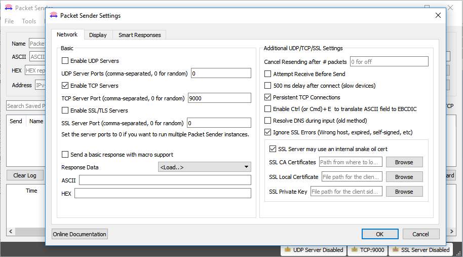

#Exemplo Logger Bluetooth Wifi

* [Arduino M0 Pro - BlueMode+S42 - GS2101M - Logger](arduino\Telit_libs\examples\Telit_Bluetooth\Telit_Bluetooth_Wifi_Logger\Telit_Bluetooth_Wifi_Logger.ino)
* [ASF/FreeRTOS - BlueMode+S42 - GS2101M - Logger](asf\examples\bms42\Logger_Wifi.rar)

##Descrição

*Este é um exemplo de um sistema de logger de bluetooth baseado em wifi, que repassa o tráfego de um dispositivo 
por porta serial bluetooth para um socket aberto em um servidor local. Permite também o fluxo de dados refletido na porta serial bluetooth*.
 
##Configurações de Hardware

*Esse exemplo foi criado para utilização da placa BlueEva+S integrado com a EVB3 da Telit e com o arduino M0 PRO.
Para correto funcionamento a conexão das placas devem ser de acordo com a seguinte pinagem:*
 
Pino Arduino M0 Pro | Pino BlueEva+S|`Pino Arduino M0 Pro`| `Pino EVB3`	   |Pino BlueEva+S| Pino EVB3
:------------------:|:-------------:|:-----------------:|:----------------:|:------------:|:---------------:
         3          |X322/EXT-RES 	|	   `3.3V`	    | `VIN_3V3`		   |  	ext. PWR  |		VIN_3V3
         4          |X324/UART-RXD	|	   `GND`		| `GND`    		   |	GND		  |		GND
         5          |X323/UART-TXD	|	   `09`		    |`EXT_RTC_RESET_N` | 
					|				|	   `10`		    |`GPIO0/UART0_RX_M`| 
					|				|	   `11`		    |`GPIO1/UART0_TX_M`| 		


##Configuração de Software

*As configurações de rede(SSID), senha, servidor(endereço ip) e protocolo deverão ser configurados manualmente através da alteração das seguintes constantes no código: SSID_WIFI, PWD_WIFI, SERVER, PORT.* 
```C++
#define SSID_WIFI       "yourNetwork" //Nome de sua rede (SSID)
#define PWD_WIFI        "yourPassword" //Senha de sua rede (WPA ou WEP key)

#define SERVER          "192.168.0.1"	//Ip do server local a conectar
#define PORT            9000	//Porta de comunicação do server
```
*Neste exemplo é necessário a utilização de um aplicativo de interface para comunicação e transmissão de dados via Bluetooth com o BlueMod+S42.*

*Para funcionamento correto é necessario que o servidor esteja localizado na mesma rede.*

###Telit "Terminal IO Utility" App

*A telit disponibiliza o aplicativo "Terminal IO Utility" para android e iOS o qual pode ser utilizado 
para estabelecer conexões bluetooth de baixa energia entre um smartphone e o BlueEva+S
Os seguintes QR-Codes proveem o link para download do "Terminal IO Utility".*


*O “Terminal IO Utility” App permite o usuario se conectar ao terminal I/O dos dispositivos perifericos
e trocar dados provendo uma simples emulação do terminal.*

###Packet Sender

*Para simulação do exemplo é possivel a montagem do servidor uitilizando o software [Packet Sender](https://packetsender.com/download).*

*Com o software instalado em um computador, execute o programa va em File>Settings e configure conforme demonstrado abaixo.* 



*A porta tcp pode ser modificada, contanto que se utilize uma outra porta disponivel e configure corretamente no codigo do exemplo.*