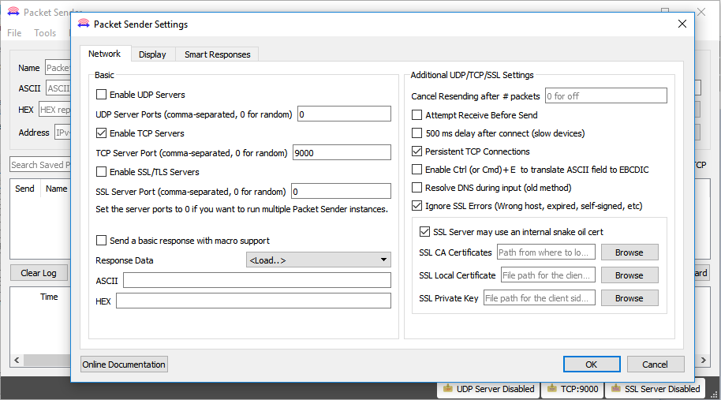

#Exemplo Logger

* [Arduino M0 Pro - XE910 - Logger](arduino\Telit_libs\examples\Telit_Modem\Telit_Modem_HE910G_Logger\Telit_Modem_HE910G_Logger.ino)
* [ASF/FreeRTOS - XE910 - Logger](asf\examples\he910\Logger.rar)

##Descrição

*Este é um exemplo de um sistema de logger baseado em modem de Tasks contínuas (ASF/FreeRTOS) ou Loop infinito (Arduino) 
que repassa o tráfego de uma das portas seriais para um socket aberto com um servidor remoto e 
bufferiza os bytes que são recebidos enquanto a conexão não estava ativa. 
O sistema verifica que a conexão caiu (contexto com a APN ou o socket) e tenta continuamente uma reconexão. 
Permite também o fluxo de dados servidor->dispositivo, refletido na porta serial. Um tunel de porta serial por TCP.*


##Configurações de Hardware

*Esse exemplo foi criado para utilização do kit EVK2 da Telit integrado com o arduino M0 PRO.
Para correto funcionamento a conexão das placas devem ser de acordo com a seguinte pinagem:*
 
Pino Arduino M0 Pro | Pino EVK2
:------------------:|:----------:
        GND         | GND    
         10         |C104/RXD
         11         |C103/TXD
         09         |RESET   


*As descrições dos pinos utilizados na placa EVK2 podem ser observadas documento: [EVK2 User Guide](https://www.telit.com/wp-content/uploads/2017/09/1vv0300704_EVK2_User_Guide_Rev21.pdf)*

##Configuração de Software

*As configurações de operadora, protocolo, servidor(endereço) e porta deverão ser configurados manualmente através da alteração das seguintes constantes no código: GPRS_OI, GPRS_PROTOCOL, SERVER, PORT.* 

```C++
#define GPRS_OI         "gprs.oi.com.br"	//Operadora do chip utilizado
#define GPRS_PROTOCOL   "IP"	//Protocolo de internet

#define SERVER          "exemplo.net"	//Endereço do server a conectar
#define PORT            9000	//Porta de comunicação do server
```
*Para funcionamento correto é necessario que o endereço(ip) do servidor remoto esteja disponivel para acesso pela internet.*

###Packet Sender

*Para simulação do exemplo é possivel a montagem do servidor uitilizando o software [Packet Sender](https://packetsender.com/download).*

*Com o software instalado em um computador, execute o programa va em File>Settings e configure conforme demonstrado abaixo.* 



*A porta tcp pode ser modificada, contanto que se utilize uma outra porta disponivel e configure corretamente no codigo do exemplo.*


