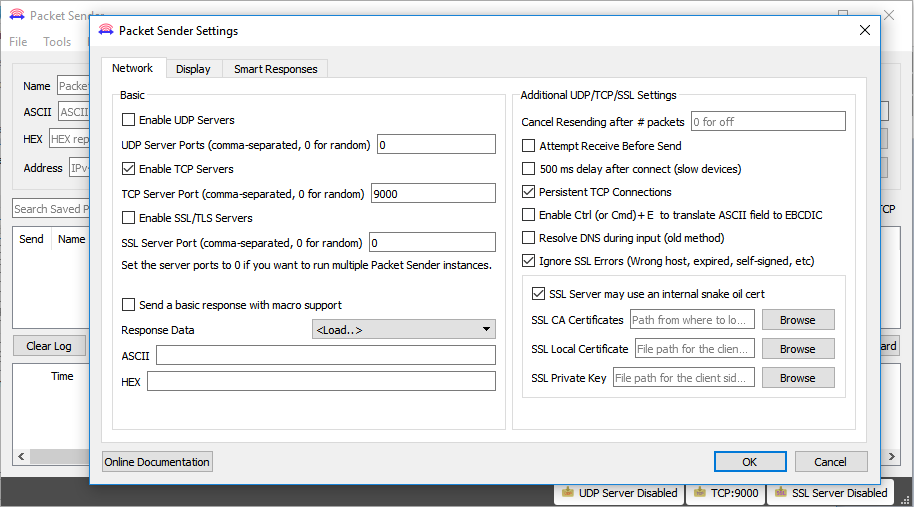

#Exemplo Logger Bluetooth Modem

* [Arduino M0 Pro - BlueMode+S42 - XE910 - Logger](arduino\Telit_libs\examples\Telit_Bluetooth\Telit_Modem_Bluetooth_Logger\Telit_Modem_Bluetooth_Logger.ino)
* [ASF/FreeRTOS - BlueMode+S42 - XE910 - Logger](asf\examples\bms42\Logger_GSM.rar)

##Descrição

*Este é um exemplo de um sistema de logger de bluetooth através de modem: o qual coloca o módulo Bluetooth
para ouvir beacons e broadcasts / advertisement próximos e os repassa diretamente para um socket aberto no modem.*
 
##Configurações de Hardware

*Esse exemplo foi criado para utilização da placa BlueEva+S integrado com a EVK2 da Telit e com o arduino M0 PRO.
Para correto funcionamento a conexão das placas devem ser de acordo com a seguinte pinagem:*
 
Pino Arduino M0 Pro | Pino BlueEva+S|	|Pino Arduino M0 Pro | Pino EVK2
:------------------:|:----------:|		|:------------------:|:----------:
        3.3V        | ext. PWR   |      |		  9	         | RESET  
		GND         | GND    	 |		|		 GND         | GND    
         3          |X322/EXT-RES |    	|		  10         |C104/RXD
         4          |X324/UART-RXD|   	|		  11         |C103/TXD 
         5          |X323/UART-TXD|		 


*Nota: Devido a alimentação externa da EVK2 se faz necessario a utilização de um capacitor de 10uF em paralelo a alimentação do BlueEva+S para evitar interferências.*

##Configuração de Software

*As configurações de operadora, protocolo, servidor(endereço) e porta deverão ser configurados manualmente através da alteração das seguintes constantes no código: GPRS_OI, GPRS_PROTOCOL, SERVER, PORT.* 
```C++
#define GPRS_OI         "gprs.oi.com.br"	//Operadora do chip utilizado
#define GPRS_PROTOCOL   "IP"	//Protocolo de internet

#define SERVER          "exemplo.net"	//Endereço do server a conectar
#define PORT            9000	//Porta de comunicação do server
```

*Neste exemplo é necessário a utilização de um aplicativo de interface para comunicação e transmissão de dados via Bluetooth com o BlueMod+S42.*

*Para funcionamento correto é necessario que o endereço(ip) do servidor remoto esteja disponivel para acesso pela internet.*

###Telit "Terminal IO Utility" App

*A telit disponibiliza o aplicativo "Terminal IO Utility" para android e iOS o qual pode ser utilizado 
para estabelecer conexões bluetooth de baixa energia entre um smartphone e o BlueEva+S
Os seguintes QR-Codes proveem o link para download do "Terminal IO Utility".*


*O “Terminal IO Utility” App permite o usuario se conectar ao terminal I/O dos dispositivos perifericos
e trocar dados provendo uma simples emulação do terminal.*

###Packet Sender

*Para simulação do exemplo é possivel a montagem do servidor uitilizando o software [Packet Sender](https://packetsender.com/download).*

*Com o software instalado em um computador, execute o programa va em File>Settings e configure conforme demonstrado abaixo.* 



*A porta tcp pode ser modificada, contanto que se utilize uma outra porta disponivel e configure corretamente no codigo do exemplo.*
