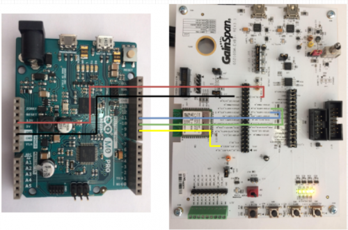

#Exemplo Logger Bluetooth Modem

* [Arduino M0 Pro - GS2101M - Logger](arduino\Telit_libs\examples\Telit_Wifi\Telit_Wifi_GS2101M_Logger\Telit_Wifi_GS2101M_Logger.ino)
* [ASF/FreeRTOS - GS2101M - Logger](asf\examples\gs2101m\TunnelTcp.rar)

##Descrição

*Este é um exemplo de um sistema de logger de Tasks contínuas (ASF/FreeRTOS) ou Loop infinito (Arduino) baseado em wifi
que repassa o tráfego de uma das portas seriais para um socket aberto com um servidor local e permite o fluxo 
de dados servidor->dispositivo, refletido na porta serial. Um tunel de porta serial por TCP.*  
 
##Configurações de Hardware

*Esse exemplo foi criado para utilização da placa BlueEva+S integrado com a EVB3 da Telit e com o arduino M0 PRO.
Para correto funcionamento a conexão das placas devem ser de acordo com a seguinte pinagem:*
 
Pino Arduino M0 Pro|Pino EVB3
:-----------------:|:--------:
GND|GND
3.3V|VIN_3V3
10|GPIO0/UART0_RX_M
11|GPIO1/UART0_TX_M
09|EXT_RTC_RESET_N




##Configuração de Software

*As configurações de rede(SSID), senha, servidor(endereço ip) e protocolo deverão ser configurados manualmente através da alteração das seguintes constantes no código: SSID_WIFI, PWD_WIFI, SERVER, PORT.*
```C++
#define SSID_WIFI       "yourNetwork" //Nome de sua rede (SSID)
#define PWD_WIFI        "yourPassword" //Senha de sua rede (WPA ou WEP key)

#define SERVER          "192.168.0.1"	//Ip do server local a conectar
#define PORT            9000	//Porta de comunicação do server
```
*Para funcionamento correto é necessario que o servidor esteja localizado na mesma rede.*

###Packet Sender

*Para simulação do exemplo é possivel a montagem do servidor uitilizando o software [Packet Sender](https://packetsender.com/download).*

*Com o software instalado em um computador, execute o programa va em File>Settings e configure conforme demonstrado abaixo.* 


*A porta tcp pode ser modificada, contanto que se utilize uma outra porta disponivel e configure corretamente no codigo do exemplo.*