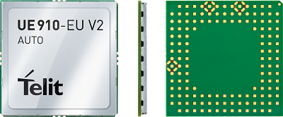

##Sobre o Módulo HE910

O módulo HE910 faz parte da família de módulos GSM da Telit xE910 destinados para aplicações automotivas e telemáticas 3G e 2G. Disponibiliza recursos avançados como localização GPS, LBS, Conexões Socket TCP/UDP, Protocolos HTTP, MQTT e outros.

###Referências

* [Página do Produto](https://www.telit.com/products/cellular-modules/standard-industrial-grade/xe910-family/)
* [Datasheet](https://www.telit.com/wp-content/uploads/2017/09/160229_DS_HE910.pdf)
* [Comandos AT](https://www.telit.com/wp-content/uploads/2017/11/Telit_3G_Modules_AT_Commands_Reference_Guide_r12.pdf)
* [Guia do Usuário](https://www.telit.com/wp-content/uploads/2017/09/Telit_HE910_Hardware_User_Guide_r29.pdf)
* [Interface Card Datasheet](http://www.adaptivemodules.com/assets/telit/Telit-HE910-Interface-Card-Datasheet.pdf)
* [Telit IP Easy User Guide](https://www.telit.com/wp-content/uploads/2017/12/Telit_IP_Easy_User_Guide_r23.pdf)
* [Telit HE910 A-GPS Application Note](https://www.telit.com/wp-content/uploads/2017/09/Telit_HE910_A-GPS_Application_Note_r4.pdf)
* [Telit HE910 DTMF](http://www.contrive.mobi/Vault/Software_User_Guide_r16.pdf)

##Sobre o Kit de Desenvolvimento EVK2

###Referências

* [EVK2 User Guide](https://www.telit.com/wp-content/uploads/2017/09/1vv0300704_EVK2_User_Guide_Rev21.pdf)
* [CS1467C](http://www.adaptivemodules.com/assets/telit/Telit-HE910-Interface-Card-Datasheet.pdf)
* [Drivers](https://www.telit.com/evkevb-drivers/)
* [Embarcados](https://www.embarcados.com.br/apresentando-o-kit-telit-evk2/)

##Configuração do Ambiente de Hardware

*O ambiente de hardware utilizado para os exemplos consiste na integração da placa Arduino M0 Pro com o Kit de Desenvolvimento EVK2.*

*Os procedimentos de setup inicial serão listados a seguir:*

**1 - Baixar e instalar os drives USB's do link: [Drivers](https://www.telit.com/evkevb-drivers/). Devem ser instalados os drivers destacados em azul, conforme indicado na imagem abaixo.**

**2 - Conectar a placa CS1467C através de seu conector miniUSB na porta USB do computador, conectar a fonte de alimentação na placa base (EVK2) e pressionar o botão de on por 5s, como indicado na imagem abaixo.**

**3 - Para testar a comunicação com o módulo através de comandos AT, deve-se instalar o software serial Telit AT Controller, disponível no mesmo link usado anteriormente pra baixer os drivers: [Drivers](https://www.telit.com/evkevb-drivers/).**

*Tela inicial do Telit AT Controller:*

*Para iniciar os testes com o módulo é preciso definir as configurações de conexão:*

 

*Configurada a conexão, basta clicar então no botão de "Connect", que é o botão da esquerda no meio da tela. Dando tudo certo e com o módulo conectado, são exibidas uma série de informações tais como IMEI, Fabricante, Modelo e versão de Firmware no centro da tela do programa, indicando que o mesmo está comunicando e recebendo dados do módulo. Veja o resultado a conexão com sucesso na figura abaixo.*

###Integração com Arduino M0 Pro

*A Conexão da EVK2 com o arduino deve ser de acordo com a seguinte pinagem:*

Pino Arduino M0 Pro | Pino EVK2
:------------------:|:----------:
        GND         | GND    
         10         |C104/RXD
         11         |C103/TXD
         09         |RESET   

*As descrições dos pinos utilizados na placa EVK2 podem ser observadas documento: [EVK2 User Guide](https://www.telit.com/wp-content/uploads/2017/09/1vv0300704_EVK2_User_Guide_Rev21.pdf)*
